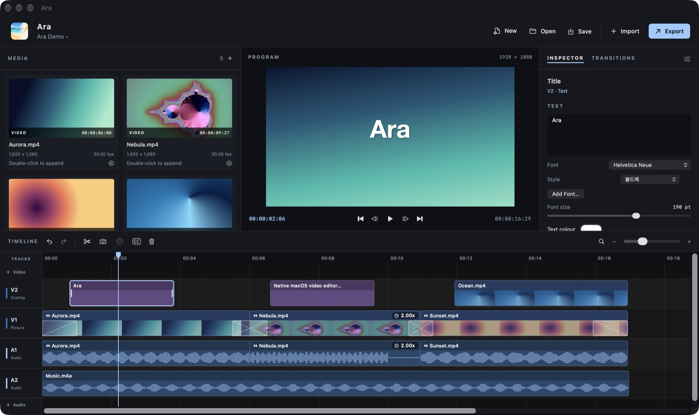
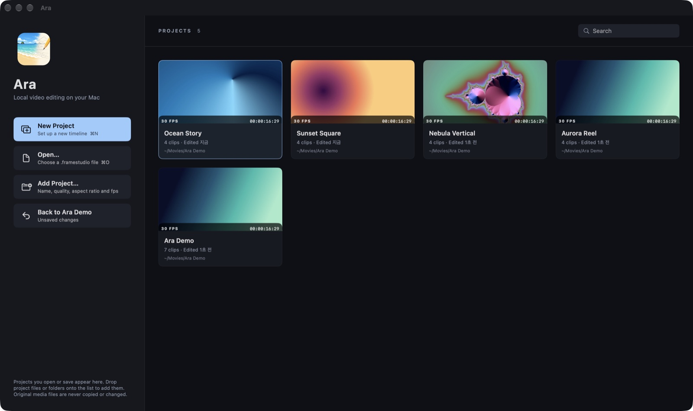
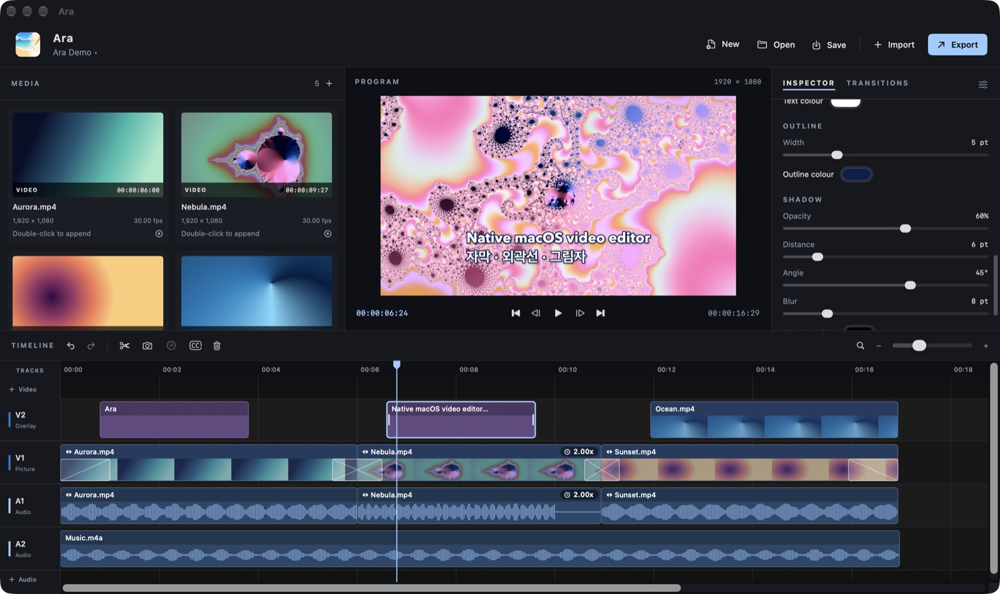
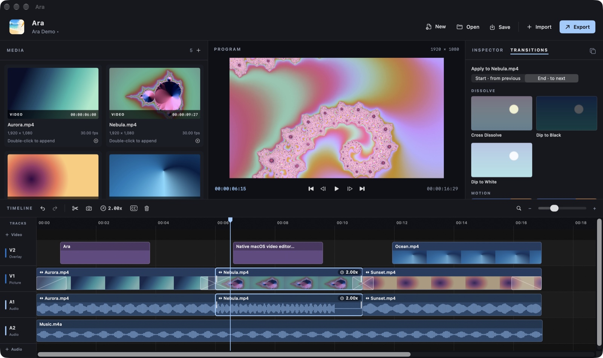
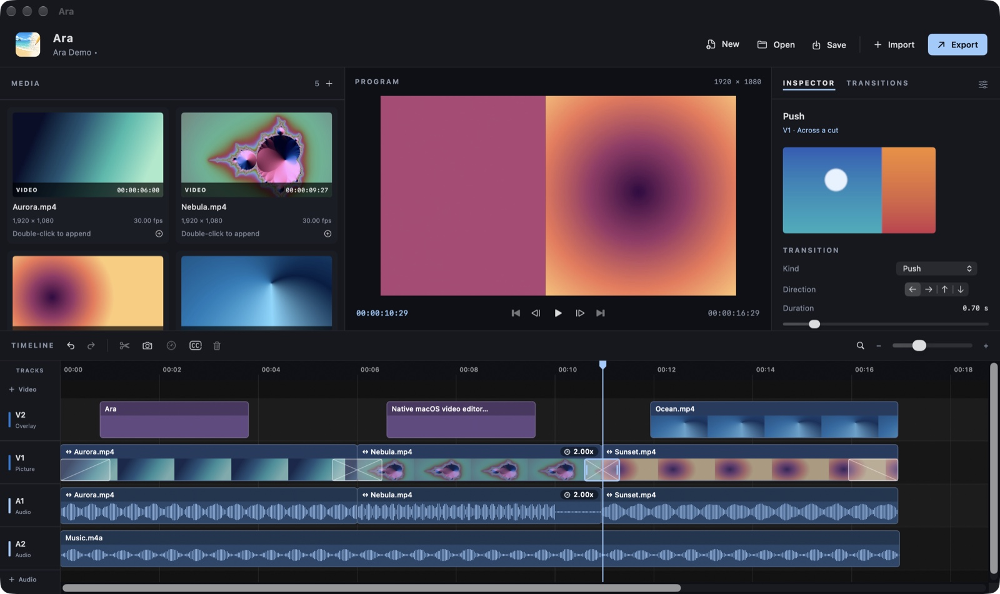
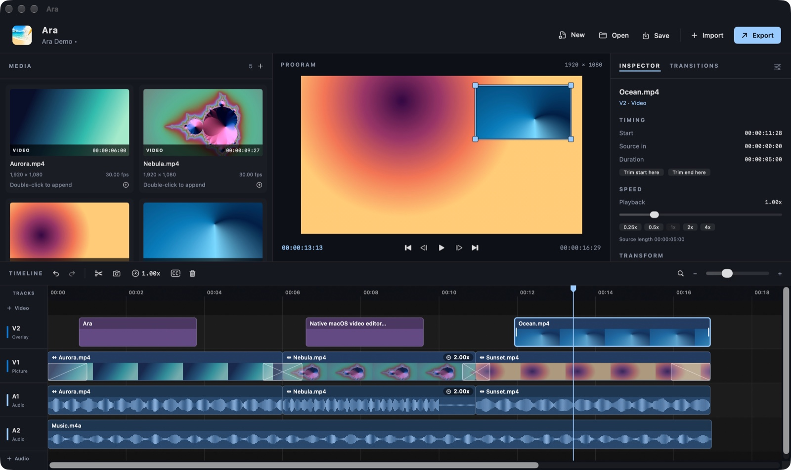
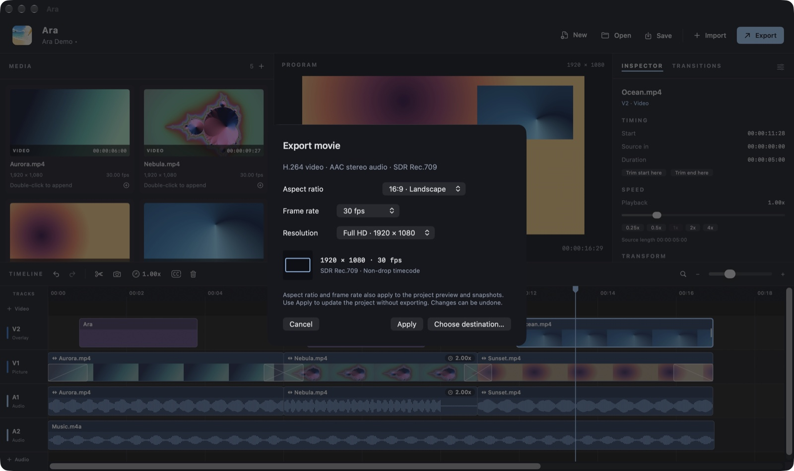

<p align="center">
  
</p>

<h1 align="center">Ara</h1>

macOS 15 이상 / Apple Silicon용 로컬 영상 편집기. Swift 6, SwiftUI·AppKit, AVFoundation, Core Image(Metal 장치의 CIContext)로 만들었다. 외부 Swift 패키지·웹뷰·서버 없이 가져오기 → 타임라인 편집 → 미리보기 → 저장 → MP4 출력이 한 앱 안에서 이어진다.



## 주요 기능

- **시작 화면**: 열었거나 저장한 프로젝트를 포스터·프레임률·길이·클립 수가 담긴 카드로 모은다. 검색, 폴더째 드롭, Finder에서 보기, 목록에서 빼기를 지원한다.
- **프로젝트 설정**: 이름, 화질 6종(HD 720p·Full HD·2K·QHD·3K·4K), 화면비 5종(16:9·9:16·1:1·4:3·4:5), 프레임률 8종(23.976–60fps). 편집 중에도 바꿀 수 있다. 컷은 새 프레임 격자로 옮겨지고(처음 바꿀 때는 가장 가까운 프레임으로) 한 컷을 함께 쓰는 클립은 같이 옮겨지므로, 맞닿은 클립은 계속 맞닿고 트랙 사이 싱크도 유지된다(12번).
- **멀티 트랙 타임라인**: 영상·오디오 트랙을 종류별 최대 8개까지 쓴다. 영상의 원본 오디오는 연결 클립으로 함께 움직인다. 비디오 트랙마다 같은 번호의 오디오 트랙이 바로 아래 소리 줄로 붙어 한 트랙처럼 보이고, 영상과 그 소리는 한 덩어리 클립으로 그려진다. 소리 줄은 접고 펼 수 있다.
  - 편집: 이동·트림·분할·삭제·복사/붙여넣기, 스냅, Undo/Redo 100단계.
  - 여러 클립 선택: 빈 트랙에서 Shift+드래그하거나 클립을 Shift+클릭해 고르고, 함께 옮기기·복사·잘라내기·붙여넣기·삭제한다.
- **빈 구간 닫기**: 빈 트랙 공간을 더블클릭해 구간을 고르고 ⌘⌫로 뒤 클립을 당겨 붙인다.
- **클립 속도**: 영상·오디오 클립을 0.1x–10x로 재생한다. 0.25x–5x 프리셋이 있고 원하는 값을 직접 입력할 수도 있다. 음높이는 유지된다.
- **프레임 단위 탐색**: 눈금자나 빈 트랙을 누른 채 드래그해 스키밍한다. 클립 끝 5프레임 안에서는 끝 경계에 붙고, Force Touch 트랙패드 햅틱을 지원한다.
- **인스펙터**: 위치·크기·회전·불투명도, 밝기·대비·채도, 볼륨·음소거를 조절한다. 위치·크기·회전·불투명도·색 슬라이더는 재빌드 없이 미리보기에 바로 반영되고, 드래그 한 번이 Undo 한 번이다.
- **미리보기에서 직접 변형**: 영상·이미지·텍스트를 더블클릭하고 드래그로 옮긴다. 크기는 모서리·핀치·⌥+스크롤로, 회전은 위쪽 핸들로 바꾼다.
- **자막**: 한글 입력, 글꼴·굵기, 크기, 색, **외곽선**, **그림자**를 지원한다. TTF·OTF·TTC 폰트나 폰트가 든 ZIP을 추가해 쓸 수 있다. 4K 출력에서는 자막을 4K 해상도로 직접 그린다.
- **즐겨찾기 클립**: 영상·자막·오디오 클립을 인스펙터의 ☆로 저장해 두고, 오른쪽 위 ★ 패널에서 어느 프로젝트의 타임라인에든 끌어 놓는다.
- **화면 전환 11종**: 디졸브·모션·와이프·스타일로 나뉜다. 마우스를 올리면 미리 보여 주고, 컷이나 클립 끝에 드래그하면 적용된다. 길이는 타임라인 핸들로 조절한다.
- **HDR 원본과 프록시**: HLG·PQ 영상을 SDR Rec.709로 변환해 편집한다. 1080p를 넘는 영상은 백그라운드에서 미리보기용 프록시를 만든다.
- **타임라인 툴바**: 버튼마다 네모 영역 전체가 눌리고(선으로 그린 CC·사각형 선택 아이콘도 빈 곳까지), 포인터를 올리면 옅은 배경이, 누르면 진한 배경과 살짝 눌리는 효과가 나온다. 켜진 모드(사각형 선택·도움말)는 파란 배경으로 표시되고, 속도 메뉴도 포인터를 올리면 배경이 나온다.
- **도움말 말풍선**: 타임라인 툴바 오른쪽 끝의 **?** 버튼(또는 도움말 → 도움말 말풍선 보기)을 누르면 각 버튼과 영역이 하는 일을 말풍선으로 보여 준다. 말풍선에는 현재 단축키도 함께 나오고, 한 줄에 다 들어가지 않는 설명은 두 줄로 나뉜다. 말풍선은 서로 겹치거나 다른 버튼을 가리지 않고, 말풍선에서 버튼으로 이어지는 선도 다른 말풍선 밑을 지나거나 다른 버튼을 가로지르지 않게 놓인다. 버튼이 몰려 있으면 양 끝에서부터 계단처럼 쌓이고, 위아래로 선을 낼 수 없으면 버튼 옆에 놓인다. 스크롤되거나 잘려서 다 보이지 않는 버튼과 숨은 버튼에는 말풍선을 달지 않는다. 아무 곳이나 클릭하거나 Esc로 닫는다. 말풍선이 떠 있는 동안에는 실행 취소·다시 실행, 미디어 가져오기, Timeline 메뉴(재생·분할·삭제·자막 추가·스냅 등)가 꺼지고, 편집 창은 Esc 말고는 어떤 키도 받지 않는다(메뉴 단축키, 타임라인·미리보기, 글자 입력란 모두). 종료·가리기·최소화·창 닫기·설정 같은 앱과 창의 키(⌘Q·⌘H·⌘M·⌘W·⌘, 등)는 그대로 동작한다. 미리보기 변형의 외곽선과 조절점도 그동안 숨고 클릭을 받지 않는다.
- **설정(⌘,)**: 인터페이스 언어(시스템 언어·English·한국어), 종류별 트랙패드 햅틱, 미리보기 변형 표시의 색, 메뉴와 타임라인 단축키를 바꾼다.
  - **미리보기** 탭: 변형 중인 클립의 외곽선과 조절점(회전 손잡이 포함), 늘이다 원래 비율에 붙었을 때의 외곽선(**원래 비율 스냅**), 스냅 정렬선, 정렬점의 색을 고른다. 위의 그림 왼쪽에는 원래 비율에 붙은 클립이 그 색으로 그려진다. 네 색의 견본은 이름 옆에 세로 한 줄로 서 있다. 자막 색과 같은 방식이다: 색 견본을 누르면 오른쪽에 기본 색이 펼쳐지고, 맨 끝 **+**는 팔레트(채도·밝기, 색조, `#RRGGBB`, 스포이트, 최근 색, 시스템 색상 패널)를 연다. 프로젝트를 바꾸지 않으므로 Undo 단계가 생기지 않는다. 위의 그림이 고른 색으로 바로 다시 그려지고, 열려 있는 미리보기에도 바로 적용된다. 색마다 ↺로, **기본값으로 복원**으로 모두 기본 색(파랑·초록·노랑·빨강)으로 되돌린다. 고른 색은 다음 실행에도 남고, 기본 색으로 되돌린 색은 저장하지 않는다(기본일 때는 시스템의 초록·노랑·빨강을 그대로 쓴다).
- **출력과 스냅샷**: H.264 + AAC MP4를 HD(1280×720)·Full HD(1920×1080)·2K(2048×1152)·QHD(2560×1440)·3K(2880×1620)·4K(3840×2160)로 출력한다(16:9 기준, 다른 화면비는 짧은 변이 같다). 현재 프레임은 sRGB PNG로 저장한다. 미리보기·스냅샷·출력은 같은 합성기를 거친다.

## 스크린샷

| | |
|---|---|
|  |  |
| 시작 화면: 최근 프로젝트 카드 | 자막: 텍스트·글꼴이 맨 위에 오는 인스펙터, 외곽선·그림자를 넣은 자막 |
|  |  |
| TRANSITIONS 탭: 타일을 타임라인에 드래그 | 전환 선택: 종류·방향·길이 |
|  |  |
| 미리보기에서 PiP 직접 변형: 위쪽 핸들로 회전 | 출력: 비율·프레임률·해상도 |

스크린샷의 영상은 모두 테스트용으로 만든 합성 영상이다.

## 빌드·실행

Xcode 16 이상과 Swift 6 툴체인이 필요하다. 검증 환경은 Xcode 27 / Swift 6.4 / macOS 27 / Apple Silicon이다.

```sh
./scripts/build-app.sh
open build/Ara.app
```

- 기본 빌드는 ARM64 Release이고, Debug는 `./scripts/build-app.sh debug`로 만든다.
- `build-app.sh`는 설치된 최신 SDK로 링크한다(최소 버전은 그대로 macOS 15). SwiftPM의 기본 링크만으로는 앱이 macOS 15 SDK로 빌드된 것으로 기록되어, AppKit·SwiftUI가 컨트롤을 이전 디자인과 크기로 그린다.
- Xcode에서 `Package.swift`를 열어 `Ara` 실행 대상을 실행해도 된다. 다만 이렇게 만든 앱도 macOS 15 SDK로 빌드된 것으로 기록되어 컨트롤이 이전 디자인으로 보인다.
- Xcode 설치 경로가 다르면 `DEVELOPER_DIR`를 지정한다. 전역 `xcode-select` 설정은 바꾸지 않는다.
- `build-app.sh`는 항상 `build/Ara.app`에 만들고, Ara가 실행 중이면 빌드하지 않는다. 앱을 종료한 뒤 다시 빌드한다.
- 앱은 개발용 ad-hoc 서명이다. Developer ID 서명·공증·App Store 샌드박스 패키징은 없다.
- 강조색은 연푸른색 `#9ACBFF`다. 기존 문서·미디어 북마크와 호환되도록 내부 앱 식별자와 `.framestudio` 확장자는 유지한다.

## 사용법

1. **시작 화면**: 앱을 파일 없이 실행하면 뜬다.
   - 카드를 더블클릭하거나 Return을 누르면 프로젝트가 열린다. 우클릭 메뉴는 **Open / Show in Finder / Remove from List**다.
   - `.framestudio` 파일이나 폴더를 목록에 드롭하면 한 번에 모인다. 찾은 파일은 목록(최대 60개)의 빈자리만 채우므로 직접 열었던 프로젝트가 밀려나지 않는다. 빈자리가 모자라면 최근에 수정한 파일부터 넣고, 넣지 못한 개수를 알려 준다. 목록이 찬 뒤에 프로젝트를 열면 찾기만 하고 열지 않은 파일이 오래된 것부터 먼저 빠진다.
   - **New Project(⌘N)**와 **Add Project…**는 이름·화질·화면비·프레임률을 정하는 창을 연다. 기본값은 Untitled(한국어로는 제목 없음)·Full HD·16:9·30fps다. 기존 파일은 **Open…(⌘O)**으로 연다.
   - 편집 중에는 툴바 왼쪽 앱 아이콘이나 **⇧⌘1**로 돌아온다. **Back to 〈프로젝트〉** 버튼이나 Esc로 편집에 복귀한다.
   - Finder에서 프로젝트를 열거나 `--project`·`--import` 인자로 실행하면 곧바로 편집기로 간다. 확장자의 대소문자는 가리지 않는다. 프로젝트와 미디어를 함께 열면 프로젝트를 연 뒤 미디어를 그 프로젝트로 가져온다. 프로젝트는 한 번에 하나만 열리므로, 여러 프로젝트를 함께 열면 첫 프로젝트를 열고 나머지는 시작 화면 목록에 넣은 뒤 알려 준다. 출력 중에는 프로젝트를 열지 않고 알린다. 출력 설정 창이 떠 있을 때 다른 프로젝트를 열면 그 창은 닫힌다.
2. **가져오기**: 툴바 **Import**나 **⌘I**로 영상·오디오·PNG/JPEG/8-bit TIFF를 가져온다.
   - Finder에서 라이브러리나 타임라인에 드롭해도 된다. `.framestudio` 파일을 드롭하면 그 프로젝트를 연다.
   - 이미 가져온 파일은 다시 추가하지 않는다. 심볼릭 링크처럼 다른 경로로 가리켜도 같은 파일이면 한 번만 들어간다. 가져오기도 ⌘Z로 되돌린다.
3. **배치·트랙**:
   - 라이브러리 썸네일을 원하는 트랙·시간에 드래그한다. 더블클릭이나 `+`는 트랙 끝에 붙인다. 영상·이미지는 V1, 오디오는 A1의 끝이고, 소리가 있는 영상은 V1과 A1 중 늦게 끝나는 곳 뒤다. 우클릭 메뉴(**Append to V1** 등)로 대상 트랙을 고른다. 이미지는 5초 클립이 된다.
   - 영상의 원본 오디오는 같은 번호의 오디오 트랙(V3 → A3)에 연결 클립으로 들어간다.
   - 트랙은 위에서부터 V2, A2, V1, A1 순서다. 오디오 트랙은 같은 번호 비디오 트랙 바로 아래에 소리 줄로 붙고, 둘 사이에는 구분선이 없다. 영상 클립과 그 소리는 한 덩어리로 그려진다. 위는 썸네일과 이름, 아래는 파형이고, 선택 테두리도 둘을 함께 감싼다. 음악처럼 따로 넣은 오디오는 같은 소리 줄에 이름과 파형을 달고 조금 띄워 그려진다. 비디오 트랙보다 번호가 큰 오디오 트랙(비디오가 2개일 때 A3)은 맨 아래에 따로 놓인다. 클립은 위아래 여백 없이 트랙 높이를 채우고, 트랙 사이에는 1pt 선만 남는다.
   - 트랙 이름 칸에서 비디오 트랙 줄 오른쪽 끝의 소리 버튼(**˅ 🔊**, 모든 트랙에서 같은 자리)을 누르면 그 아래 소리 줄이 접히고(버튼은 **› 🔇**가 된다), 다시 누르면 펼쳐진다. 소리 줄에는 이름을 따로 달지 않는다. 소리 바는 영상 클립과 따로 그려진다. 접을 때는 영상 클립은 그대로 있고 소리 바만 줄어들며 올라가 영상 클립 아래쪽에 얇게 덮이고, 펼 때는 덮여 있던 소리 바만 내려오며 원래 크기로 커진다(0.32초, 누르자마자 움직이기 시작해 부드럽게 멈추며, 트랙 이름 칸도 같은 곡선으로 움직인다. 도중에 다시 누르면 그 자리에서 되돌아간다. 소리 줄의 ✕도 함께 서서히 나타나고 사라진다). 접힌 소리 줄은 사라져 위아래 트랙의 클립이 여백 없이 붙는다. 그동안 영상의 소리는 영상 클립 아래쪽(썸네일 위)에 얇은 소리 바로 덮여 파형이 보이고, 그 자리를 눌러도 영상이 골라진다. 소리 바의 배경은 접혔을 때 완전히 투명해 썸네일이 그대로 비치고, 펼치면 투명도 10%(거의 불투명)가 되며, 접고 펴는 동안 그 사이에서 바뀐다. 음악처럼 따로 넣은 오디오가 있는 소리 줄만 접혀도 얇은 띠로 남아, 그 오디오가 보이고 클릭해 고르거나 끌어 옮길 수 있다. 접은 상태는 다음 실행에도 남는다. 새로 생긴 트랙(트랙 추가, 자막·붙여넣기·즐겨찾기로 생긴 트랙 모두)의 소리 줄은 접힌 채로 나오고, 새 프로젝트는 모든 소리 줄이 접힌 채로 시작한다.
   - 한 트랙의 위(영상)와 아래(소리)는 같은 트랙으로 다룬다. 영상을 소리 줄에 놓아도 그 위 비디오 트랙에 들어가고, 오디오 파일을 영상 줄에 놓아도 그 아래 소리 줄에 들어간다. 전환도 소리 줄 위에서 놓으면 위 영상의 컷이나 끝에 들어간다.
   - **＋ Video / ＋ Audio**로 트랙을 추가한다. 비어 있는 추가 트랙(V3·A3 이상)은 이름 옆 **✕**로 지운다.
4. **편집**:
   - 클립 가운데를 끌어 이동하고 양끝 손잡이로 트림한다. 같은 종류의 다른 트랙으로 옮길 수 있고, 연결 클립도 짝 트랙으로 따라간다.
   - 클립 양끝 7pt 안쪽은 클립 높이 전체가 트림 손잡이다. 포인터를 올리면 ↔ 커서가 뜬다. 페이드 인·아웃이 붙은 끝도 그 클립의 끝이라 그대로 트림되고, 페이드는 끝을 따라간다. 컷 전환이 덮은 끝은 아래쪽 전환 띠를 누르면 전환이 선택되고, 위쪽 제목 줄에서 트림한다. 선택한 클립의 손잡이 표시도 그런 끝에서는 제목 줄에 그려진다.
   - 옮기는 동안 포인터가 다른 종류의 트랙(영상 클립이면 오디오 트랙)이나 트랙 밖으로 가도 클립은 지금 트랙에 남고 시간만 따라간다.
   - 트림은 원본의 처음·끝, 옆 클립, 1프레임 길이에서 멈춘다. 한계를 넘어 끌고 놓아도 한계까지는 적용된다.
   - 드래그 도중 ⌘Z 등으로 타임라인(클립·전환·트랙)이 바뀌면 그 드래그는 알림 없이 취소된다. 그사이 가져오기가 끝나 미디어만 늘었을 때는 드래그가 그대로 이어진다.
   - 드래그는 클립 경계·재생 헤드·타임라인 시작에 스냅된다. 드래그하는 동안 **Shift**를 누르면 그 드래그만, **N**은 전체 스냅을 끈다. (드래그를 시작할 때 누른 Shift는 선택에 쓰인다.) 스냅을 켜고 끈 상태는 다음 실행에도 유지된다.
   - **⌘B**는 선택 클립을 재생 헤드에서 분할한다. 눈금자나 빈 트랙을 누른 채 드래그하면 스키밍한다.
   - **여러 클립 선택**:
     - 빈 트랙 공간에서 **Shift+드래그**하면 사각형에 닿는 클립이 모두 선택된다. 이미 선택된 클립에 더해진다.
     - 타임라인 툴바의 **사각형 선택** 버튼(CC 오른쪽)을 누르면 다음 한 번의 드래그가 Shift 없이 사각형 선택이 된다. 클립 위에서 시작해도 되고, 새 사각형이 기존 선택을 대신한다(Shift를 함께 누르면 더한다). 드래그가 끝나면 저절로 꺼지고, **Esc**로도 끈다. 드래그 없이 클릭하면 그 클립만 선택되고(Shift를 누르면 더하고, 빈 곳이면 선택이 풀린다) 역시 꺼진다.
     - 클립을 **Shift+클릭**하면 선택에 넣거나 뺀다. **⌘A**는 모든 클립을 선택하고, **Esc**는 선택을 푼다.
     - 선택한 클립 중 하나를 끌면 모두 같은 시간만큼 함께 움직인다(트랙은 그대로). 그냥 클릭하면 그 클립만 선택된다.
     - **⌘C / ⌘X / ⌘V / Delete**가 선택한 클립 전부에 적용된다. 붙여넣을 때는 가장 앞 클립이 재생 헤드에 오고, 나머지는 원래 트랙과 간격을 유지한다.
     - 붙여넣을 트랙의 그 자리에 이미 클립이 있으면, 붙여넣는 클립이 모두 함께 비어 있는 위 트랙으로 올라간다. 위 트랙이 없으면 새 트랙을 만든다. 영상과 연결 오디오는 같은 번호(V3↔A3)를 유지하고, 8개 트랙이 모두 차 있을 때만 붙여넣지 않는다.
     - 복사하면 클립의 효과(색·변형·볼륨·자막 설정·속도)와 전환이 함께 간다.
       - 페이드 인·아웃, 함께 복사한 클립 사이의 전환은 그대로 따라간다.
       - 복사하지 않은 옆 클립과의 전환은 같은 종류의 페이드가 된다. 길이는 그 클립 안에 걸쳐 있던 만큼(대개 절반)이다. 예: 다음 클립으로 넘어가는 1초 디졸브는 0.5초 디졸브 페이드 아웃이 된다.
     - 여러 개를 선택하면 인스펙터에 개수와 범위, Copy·Cut·Delete가 나온다. 설정은 클립 하나씩 바꾼다.
   - 재생 중 재생 헤드가 보이는 타임라인의 오른쪽 끝에 닿으면 다음 화면으로 넘어간다. 재생 중에 다른 곳으로 스크롤해 두었으면 끌어오지 않는다. 재생 헤드가 화면 밖에 있을 때 재생을 시작하면 그 위치를 먼저 보여 준다.
5. **빈 구간 닫기**: 빈 트랙 공간을 더블클릭하면 그 구간이 선택되고, 인스펙터에 시작·끝·길이가 나온다.
   - **⌘⌫**(Timeline → Close Gap)는 같은 트랙의 뒤 클립과 연결 클립을 그 길이만큼 당긴다.
   - 당긴 결과가 다른 클립과 겹치면 아무것도 옮기지 않는다.
6. **재생 속도**: 타임라인 툴바의 속도계 메뉴(0.25x–5x 프리셋, **Custom…**)나 인스펙터의 재생 속도 줄(STYLE의 볼륨·불투명도 줄 아래, 속도계 표시·로그 눈금 슬라이더·배속 입력칸, 그 아래 0.25x–5x 프리셋과 원본 길이)로 바꾼다. 입력칸에는 `2.5`, `2.5x`, `250%`처럼 넣는다.
   - 인스펙터의 속도 칸이나 **Custom…**에 `2.5`, `2.5x`, `250%`처럼 0.1x–10x 값을 입력하고 Return을 누른다. 소수 둘째 자리까지 쓴다. 슬라이더는 로그 눈금이라 1x가 가운데다.
   - 4x보다 빠르거나 0.25x보다 느린 클립이 있는 문서는 이전 버전 Ara(0.25x–4x)에서 열리지 않는다.
   - 원본 구간은 그대로 두고 타임라인 길이가 바뀐다. 길이는 프레임 단위로 내림하므로 빠르게 하면 끝의 원본이 조금 덜 쓰일 수 있다(150프레임 클립을 4x로 하면 37프레임이 되고 원본 148프레임을 쓴다). 그래도 메뉴나 입력값으로 1x에 돌아오면 원래 구간이 그대로 돌아오고(그사이 프레임률을 바꿨으면 새 격자에 들어가는 만큼), 클립이 원본 끝점을 넘어 읽는 일은 없다. 클립이 1프레임보다 짧아지는 속도는 적용하지 않고 알린다. 속도를 바꾼 클립에는 `2.00x` 같은 배지가 붙는다.
   - 느리게 하면 클립이 길어진다. 같은 트랙이나 연결 오디오 트랙의 뒤 클립과 겹칠 만큼 느린 속도는 적용하지 않고, 뒤에 공간이 없다고 알린다. 이때 **Custom…** 창은 닫히지 않아 다른 값을 넣을 수 있다.
   - 인스펙터 슬라이더로 느리게 하면 뒤 클립에 닿는 속도에서 멈추고, 그 까닭을 상태 메시지(툴바의 프로젝트 이름에 포인터를 올리면 보이는 도움말)로 한 번 알린다. 이 안내는 미리보기를 다시 만든 뒤에도 남는다. 빠르게 하면 클립이 1프레임이 되는 속도에서 멈춘다. 슬라이더 드래그 한 번은 Undo 한 번이고, 메뉴에는 **속도 변경**으로 나온다.
7. **인스펙터**: 클립을 선택하면 오른쪽 **INSPECTOR**에 섹션이 나온다. 맨 위 클립 이름 오른쪽에는 즐겨찾기 ☆ 버튼이 있다(아래). 자막이면 그 아래로 TEXT 제목과 내용 입력란, 그다음 **정렬점 재조정** 버튼(◎ 표시만, 왼쪽)과 정렬점 X / Y 좌표(오른쪽 끝)가 한 줄에 온다. 영상·이미지는 이름 아래에 STYLE(볼륨·불투명도·재생 속도)이 먼저 오고, 그 아래 **POSITION**(포지션) 제목 밑에 같은 정렬점 줄이 온다. 자막 클립은 그 뒤에 글꼴·굵기, TITLE STYLE(자막 스타일: 색·크기), OUTLINE·SHADOW가 오고(8번), TIMING은 맨 아래 Reset appearance 바로 위에 온다.
   - **TRANSFORM**: 위치·크기(5–400%)·가로 늘이기·세로 늘이기(영상·이미지만)·회전(불투명도는 STYLE로 옮겼다). 크기와 회전 슬라이더도 미리보기의 핀치·회전 핸들처럼 정렬점을 기준으로 바꾼다(10번). 미리보기가 아직 그려지지 않았거나 없는 원본 때문에 멈춘 동안에도 같다.
   - **COLOUR · SDR**: 밝기·대비·채도
   - **STYLE**(스타일): 클립 이름 바로 아래, POSITION 위에 온다. 볼륨(스피커 표시, 0–200%)과 불투명도(반원 표시, 0–100%)가 각각 슬라이더와 % 입력칸 한 줄이다(자막의 크기·외곽선 줄과 같은 모양, 음소거 스위치는 없다). 볼륨은 소리가 있는 클립(오디오, 연결 오디오가 있는 영상)에만, 불투명도는 영상·이미지에 나온다. 자막은 TITLE STYLE의 색·크기 줄 아래에 불투명도 줄이 있다. 줄 앞 표시 칸은 색 견본과 같은 폭이라 모든 줄의 슬라이더가 같은 위치에서 시작한다. 영상 클립에서 볼륨을 바꾸면 연결 오디오에 적용된다. 이전 버전에서 음소거한 클립은 0%로 보이고, 볼륨을 움직이거나 입력하면 음소거가 풀린다.
   - 크기·외곽선 두께·볼륨·정렬점 X / Y 입력칸은 Return을 누르거나 칸을 벗어날 때 한 번에 적용된다(치는 도중에는 바뀌지 않아서 1, 10, 100…처럼 중간 값으로 움직이지 않는다). 숫자가 아니면 원래 값으로 돌아간다.
   - **TIMING**: 시작·원본 시작점·길이. 트림은 타임라인에서 클립 양끝 손잡이로 한다.
   - SHADOW·TRANSFORM·COLOUR 제목 줄 오른쪽 끝의 **›** 버튼(또는 제목 줄 아무 곳)을 누르면 섹션을 접고 펼친다. 접힌 제목 줄에는 SHADOW는 켜진 그림자의 불투명도와 색(예: `60% ●`)이나 **Off**가, TRANSFORM·COLOUR는 값이 기본값에서 바뀌었으면 **Edited**, 아니면 **Default**가 보인다. 접은 상태는 다음 실행에도 남고, 그림자 색 줄이 열린 채 접으면 그 줄은 닫힌다. OUTLINE은 접히지 않는다.
   - **Reset appearance**는 텍스트 내용만 남기고 나머지 설정을 모두 기본값으로 되돌린다: 변형, 색 보정, 볼륨·음소거, 글꼴·글자 크기·색, 외곽선·그림자. 볼륨·음소거는 연결된 클립에도 적용된다.
   - **즐겨찾기 클립**: 클립 이름 오른쪽 ☆을 누르면 그 클립이 즐겨찾기에 저장되고 별이 노랗게(★) 바뀐다. 다시 누르면 빠진다. 영상은 연결된 소리와 원본 파일(북마크 포함), 썸네일까지 함께 저장되고(소리 클립에서 눌러도 그 영상이 저장된다), 자막은 문구·글꼴·색·외곽선·그림자·변형이 그대로 저장된다. 클립의 전환 효과도 함께 저장된다. 페이드 인·아웃은 그대로, 옆 클립과 걸친 컷 전환은 이 클립 쪽 절반 길이의 같은 종류 페이드로 저장된다(복사·붙여넣기와 같은 규칙). 끌어 놓으면 새 클립에 다시 붙고, 카드에는 전환 아이콘이 표시된다. 즐겨찾기는 `~/Library/Application Support/com.framestudio.editor/Favorites.json`에 저장되어 모든 프로젝트에서 쓴다.
   - 옆 패널 오른쪽 위 **★**을 누르면 즐겨찾기 패널이 열린다(다시 누르면 인스펙터로 돌아간다). 카드는 새로 저장한 것부터 나오고, 자막은 그 글꼴과 색으로, 영상은 썸네일로 보인다. 카드를 타임라인에 끌어다 놓으면 그 자리에 들어간다. 끄는 동안에는 미디어를 끌 때처럼 카드 그림(자막은 그 글꼴과 색의 문구, 영상은 썸네일)이 포인터를 따라온다. 스냅과 햅틱은 미디어를 놓을 때와 같고, 영상은 소리와 함께, 자막은 영상 줄에 들어간다(소리 줄 위에 놓아도 그 위 영상 줄로). 놓을 수 없는 자리(다른 클립이 있는 곳)에는 들어가지 않는다. 실행 취소 한 번(**즐겨찾기 클립 추가**)으로 되돌린다. 즐겨찾기에서 넣은 클립은 타임라인에서 이름 앞에 노란 ★이 붙고(문서에 저장되어 다시 열어도 남는다. 예전 버전 Ara는 이 표시를 무시한다), 인스펙터의 ☆도 채워져 보인다. 그 ★을 누르면 원래 즐겨찾기가 빠진다.
   - 원본이 지금 프로젝트에 없으면 원본도 함께 추가되고(같은 파일이 있으면 그것을 쓴다), 원본을 찾을 수 없으면 넣지 않고 그렇다고 알린다. 프레임률이 다른 프로젝트에 넣으면 길이는 그 프로젝트의 프레임에 맞춰 내림한다. 카드에는 길이가 분:초(예: `00:03`)로 나오고, 그 줄 오른쪽 끝의 휴지통 버튼이나 우클릭 메뉴로 즐겨찾기에서 뺀다. 즐겨찾기에 저장하기·빼기도 다른 편집과 같은 순서로 ⌘Z(**즐겨찾기에서 삭제**·**즐겨찾기에 저장** 되돌리기)와 ⇧⌘Z로 되돌린다. 문서는 바뀌지 않으니 저장 안 된 변경으로 치지 않고, 다른 문서를 열면 실행 취소 기록과 함께 넘어가지 않는다.
8. **자막**: 타임라인 툴바의 **CC 아이콘 / ⇧⌘T**로 재생 헤드 위치에 3초 자막을 넣는다. 그 구간의 영상보다 위 트랙(최소 V2)에 놓인다. 재생 헤드 위치의 트랙이 모두 차 있으면 맨 위 트랙 위에 새 비디오 트랙을 만들어 넣는다(8개까지). 새 자막의 이름과 문구는 인터페이스 언어를 따른다(한국어로는 자막, 이야기는 여기서 시작됩니다).
   - **TEXT**: 내용(한글 입력, 입력란은 클립 이름 바로 아래), 글꼴(**Font**)·굵기(**Style**), 크기, 색을 정한다. 내용은 2000자까지다. 더 길게 붙여 넣으면 들어가는 만큼만 남고 입력란 아래에 안내가 나온다. 2000자가 찬 자막에 글자를 넣어도 끝의 글자가 밀려 지워지지 않는다. 어느 쪽이든 커서는 입력하던 자리에 남는다. 입력한 글자는 0.04초 안에 미리보기와 타임라인에 보이고, 한글처럼 조합 중인 글자(예: "한ㄱ"의 ㄱ)도 입력칸에 보이는 그대로 바로 보인다. 조합을 취소하면 그 글자도 빠진다.
   - Font 메뉴의 **Added**·**System** 제목과 이 Mac에 없는 폰트의 **(missing)** 표시도 인터페이스 언어를 따른다.
   - Font·Style 메뉴는 각 항목을 그 글꼴로 보여 줘서 고르기 전에 모양을 볼 수 있다. 메뉴를 닫은 버튼에도 지금 적용된 글꼴 이름과 굵기가 그 글꼴로 보인다(아주 큰 글꼴은 버튼에 맞게 작게). 기호·이모지 폰트와 이름 글자가 없는 폰트(아랍어·히브리어 등, 한글 굵기 이름을 그릴 수 없는 영문 폰트 포함)는 읽을 수 있게 시스템 글꼴로 보여 준다.
   - 글꼴·굵기는 정렬점 줄 바로 아래, 글자 색·크기는 그 아래 **TITLE STYLE**(자막 스타일) 제목 아래에 있다. 글자 색과 크기는 한 줄이다: 왼쪽에 색 견본, 가운데 크기 슬라이더(8–300pt, 1pt 단위, 드래그 한 번이 Undo 한 번), 오른쪽에 크기 입력칸(pt). 입력칸에 숫자를 넣고 Return을 누르거나 다른 곳을 누르면 그 크기가 된다(Undo 한 번, 8–300 밖의 값은 그 끝으로). 색 견본을 눌러 기본 색을 펼치는 동안에는 슬라이더와 입력칸이 비켜서 기본 색이 줄을 다 쓴다. OUTLINE도 같은 한 줄이다: 외곽선 색 견본, 두께 슬라이더(0–20pt, 0.5pt 단위), 두께 입력칸(소수 한 자리까지, 입력한 값은 그대로). 입력한 두께가 0으로 읽히면(0.5pt 미만) 외곽선이 꺼지고, 꺼진 동안 색 견본은 흐리게 보인다.
   - 글꼴 메뉴 왼쪽의 **+**(Add Font…)나 **File → Add Fonts…**로 TTF·OTF·TTC 파일이나 폰트가 든 ZIP을 추가한다. 라이브러리·타임라인이나 시작 화면에 끌어다 놓아도 된다.
   - **OUTLINE**(두께·색), **SHADOW**(불투명도·거리·각도·흐림·색): 두께나 불투명도를 0보다 크게 하면 켜진다. 표시가 0이 되는 값(두께 0.5pt·불투명도 0.5% 미만)은 0이 되어 꺼지고, 색 선택도 함께 꺼진다. 예전 버전에서 그보다 작게 저장된 값은 소수 한 자리로 보인다. 슬라이더 한 번 드래그가 Undo 한 번이다.
   - **색**(글자·외곽선·그림자): 색 견본을 클릭(또는 더블클릭)하면 오른쪽에 기본 색(흰색·검은색·노랑·주황·빨강·초록·파랑·보라)이 원으로 펼쳐진다. 원을 누르면 미리보기를 다시 만들지 않고 바로 바뀌며, 색마다 Undo 한 번(글자 색·외곽선 색·그림자 색)이다. 줄은 열린 채 남아 여러 색을 차례로 해 볼 수 있고, 지금 색과 같은 원에는 테두리가 표시된다. 견본을 다시 클릭하거나 다른 클립을 고르면 닫히고(더블클릭의 두 번째 클릭으로는 닫히지 않는다), 외곽선·그림자가 꺼지면 그 색의 줄도 닫힌다. 인스펙터가 좁으면 들어가는 만큼만 보이고 맨 끝 **+**는 늘 남는다.
   - **+**는 팔레트를 연다: 채도·밝기 사각형과 색조 막대(드래그 한 번이 Undo 한 번, 흰색·검은색까지 끌어도 색조가 남는다), `#RRGGBB` 입력(# 생략·3자리 가능, Return이나 다른 곳을 누르면 적용, 잘못된 값은 경고음과 함께 되돌린다, 한글 입력 상태로 친 a–f도 읽는다), 스포이트, 기본 색, 최근 색(이 컨트롤로 넣은 마지막 8개, 다시 열어도 남는다), 그리고 macOS 색상 패널을 여는 **시스템 색상…**(팔레트가 열려 있는 동안 같은 색을 바꾼다). 편집 창의 다른 곳을 누르거나 Esc로 닫는다.
9. **화면 전환**: 인스펙터 옆 **TRANSITIONS** 탭에서 고른다. 타일에 마우스를 올리면 미리보기가 재생된다.
   - 적용: 두 클립이 맞닿은 컷에 드래그하면 컷 전환, 클립의 시작·끝에 드래그하면 페이드 인·아웃이 된다. 클립을 선택하고 Start/End를 고른 뒤 타일을 클릭해도 된다.
   - 전환이 선택된 동안(방금 추가한 전환 포함) 다른 타일을 클릭하면 그 전환의 종류만 바뀌고 자리·길이·방향은 그대로다. 여러 종류를 차례로 눌러 비교할 수 있다. 패널 위쪽에 클릭하면 무엇을 하는지(**Apply to 〈클립〉** 또는 **Replace 〈전환〉**) 나온다.
   - 조절: 컷 전환은 양끝을, 페이드 인은 오른쪽 끝을, 페이드 아웃은 왼쪽 끝을 끌어 길이를 바꾼다. 클립 경계 쪽 끝은 고정되고, 그 끝을 끌면 클립이 트림된다.
   - 전환을 클릭하면 인스펙터에서 종류·방향·길이를 바꾼다. 길이 슬라이더 드래그 한 번은 Undo 한 번(**전환 길이**)이다.
   - 선택한 전환은 **Delete**, Timeline 메뉴의 삭제 명령, 타임라인 툴바의 휴지통으로 지운다. 키보드 포커스가 어디에 있든 된다. 인스펙터의 **Remove transition** 버튼과 전환을 추가한 뒤의 상태 메시지는 지금 삭제에 지정된 키를 보여 준다(지정된 키가 없으면 키 없이).
10. **미리보기 변형**: 재생 헤드 위치의 영상·이미지·텍스트를 미리보기에서 **더블클릭**하면 외곽선과 모서리 조절점이 나타난다. 타임라인에서 영상·이미지·자막 클립을 클릭해 골라도 같은 상태가 된다(재생 헤드가 그 클립 위에 있을 때 외곽선이 보이고, 재생 헤드가 클립 안으로 들어오면 나타난다). 소리 클립이나 빈 트랙을 누르거나 여러 클립을 고르면 끝난다.
    - 안쪽을 드래그하면 이동하고, 모서리를 드래그하면 비율을 유지해 크기를 바꾼다. 모서리 위에서 포인터는 그 모서리의 대각선 방향 양방향 화살표(↖↘ 또는 ↗↙)가 되고, 돌린 클립은 함께 돌아간 방향에 가장 가까운 화살표가 된다(45° 돌리면 가로·세로). 핀치나 **⌥+스크롤**은 정렬점(처음엔 가운데)을 기준으로 크기를 바꾼다.
    - 클립의 정렬점에 빨간 원과 십자선이 보인다(정렬선에 붙으면 노란색). 아래 그림을 가리지 않게 70% 불투명도로 옅게 그려지고, 정렬점 재조정 중에는 선명하게 보인다. 정렬점은 처음엔 가운데이고, 인스펙터의 클립 이름(자막은 내용 입력란) 아래 **정렬점 재조정**(◎ 버튼)을 누른 뒤 미리보기를 클릭하거나 드래그해 옮긴다. 클립 밖에도 놓을 수 있다. 가운데·모서리·가장자리 중간 9곳에 8pt 안에서 붙고(트랙패드 진동), Shift나 스냅 끄기로 자유롭게 놓는다. 재조정 중에는 포인터가 십자선이 되고 회전 핸들은 숨는다. 더블클릭도 정렬점을 놓을 뿐 다른 클립을 고르거나 변형 모드를 끝내지 않고, 핀치·⌥스크롤로는 크기가 바뀌지 않는다. **정렬점 재조정**을 누르면 키보드 포커스가 미리보기로 옮겨 간다. Return·Esc나 **완료**(◎ 자리에 나타나는 ✓ 버튼)로 끝내고(타임라인에 포커스가 있어도 재조정만 끝나고 변형 모드는 유지된다. 이때 Esc는 타임라인의 드래그 취소와 사각형 선택 끄기도 함께 한다), 재조정 중에 ✓ 옆에 나타나는 **정렬점 초기화**(↺ 버튼)로 가운데로 되돌린다. 버튼 이름은 마우스를 올리면 보인다. 회전과 핀치·⌥스크롤 크기 조절(인스펙터의 회전·크기 슬라이더 포함)은 정렬점을 기준으로 한다. 정렬점을 옮겨도 그림 자체는 바뀌지 않는다. 클립을 옮기다가 정렬점이 화면 중앙이나 지금 보이는 다른 클립·자막의 정렬점과 가로 또는 세로로 5pt 안에 들면 그 줄에 붙는다(정렬점을 옮기지 않았으면 가운데끼리). 화면 중앙선에서 5pt 안에 있는 다른 클립의 정렬점은 그 방향의 줄로 쓰지 않아서, 중앙 근처에서는 정확히 중앙에만 붙는다(중앙에서 1–2픽셀 벗어난 다른 자막 때문에 중앙 옆에 한 번 더 붙지 않는다). 이때 노란 정렬선이 나타나고 트랙패드가 한 번 진동한다. 회전하지 않은(또는 90° 단위로 돌린) 클립은 옮길 때 가장자리도 화면 가장자리·화면 중앙선·다른 클립의 가장자리와 중앙선에 5pt 안에서 붙는다(정렬점과 가장자리 중 가까운 쪽). 모서리로 크기를 조절하거나 변 가운데로 늘일 때도 끌고 있는 모서리·변이 같은 선에 붙는다(모서리는 비율을 지킨 채 가로나 세로 중 가까운 선에). 화면 가장자리·중앙선 근처 5pt 안의 다른 클립 선은 쓰지 않아서 화면 선에만 정확히 붙는다. 드래그 중 Shift나 스냅 끄기(N)로 붙지 않게 한다.
    - 위쪽 가운데의 **회전 핸들**을 돌리면 클립이 정렬점을 기준으로 돈다. 돌리는 동안 옆에 각도가 표시된다.
      - **Shift**를 누르면 15° 단위로 돈다.
      - 스냅(N)이 켜져 있으면 0°·±90°·180° 근처 2° 안에서 그 각도에 붙는다.
      - 자막 그림자는 돌려도 화면 기준 방향을 유지한다.
    - 한 번의 드래그가 한 번의 Undo다. 드래그나 핀치 도중 ⌘Z 등으로 그 조작이 닫히면 거기서 끝난다. 그때까지 바뀐 것은 따로 한 번의 Undo가 되고(⌘Z였다면 그 ⌘Z가 되돌린다), 버튼을 놓을 때까지 더 움직여도 바뀌지 않는다. 핀치를 이어 가면 새 Undo가 된다. 그사이 가져오기가 끝나면 조작은 이어지고, 가져오기가 그 조작보다 앞선 Undo가 되므로 조작을 되돌려도 가져온 미디어는 남는다.
    - 외곽선이 떠 있는 동안 ←/→/↑/↓는 재생 헤드 대신 클립을 화면 1픽셀씩(Shift는 10픽셀씩) 옮기고 위치는 정수 픽셀에 맞춰진다. 연달아 누른 이동은 Undo 한 번(**클립 조정**)이다. ⌥←/⌥→(클립 처음·끝으로)와 정렬점 재조정 중에는 옮기지 않는다.
    - 인스펙터의 **정렬점 재조정**(◎) 버튼 오른쪽 **X / Y**는 정렬점의 위치를 화면 왼쪽 위를 (0, 0)으로 한 픽셀 좌표로 보여 준다(정렬점을 옮기지 않았으면 클립 가운데, 16:9 화면 정중앙은 960, 540). 숫자를 입력하고 Return을 누르거나 다른 곳을 누르면 정렬점이 그 자리에 오도록 클립이 옮겨진다(Undo 한 번, 정렬점의 클립 안 위치는 그대로). 방향키 이동도 이 좌표를 정수 픽셀로 맞춘다. 숫자를 입력하는 동안 ←/→는 커서를 움직인다.
    - 영상·이미지의 외곽선에는 네 변 가운데에 둥근 조절점이 있다. 끌면 그 방향으로만 늘이거나 줄인다(왼쪽·오른쪽 변은 가로, 위·아래 변은 세로, 클립을 돌렸으면 클립의 축을 따라). 반대쪽 변은 제자리에 있고, 5%–1000%까지이며, 한 번 끄는 것이 Undo 한 번이다. 늘이다가 원래 비율(가로·세로가 같은 만큼 늘어난 상태) 위치의 5pt 안에 오면 정확히 원래 비율에 붙고, 붙어 있는 동안 외곽선과 조절점이 초록색(설정 ▸ 미리보기 ▸ 원래 비율 스냅)으로 바뀌며, 트랙패드가 한 번 진동하고 상태 메시지에 **원래 비율**이 나온다(돌린 클립도 같다, Shift나 스냅 끄기로 끈다). 포인터는 늘이는 방향의 화살표로 바뀌고, 늘이는 동안에는 위쪽 회전 손잡이가 숨었다가 손을 떼면 다시 나타난다. 모서리(크기)가 변 가운데보다, 회전 손잡이가 모서리보다 먼저 잡히고, 위쪽 변 가운데는 회전 손잡이 막대가 시작하는 곳이지만 늘이기로 잡힌다. 자막에는 변 가운데 조절점이 없다. 미리보기·스냅샷·출력에 같이 적용되고, 이전 프로젝트는 늘이지 않은 상태로 열린다.
    - **Return**(또는 Enter)이나 **Esc**로 변형 모드를 끝낸다. 드래그 도중이면 Return은 그 변경을 유지하고, Esc는 그 드래그를 되돌린다. Return은 클립 선택도 풀고 키보드를 타임라인으로 넘겨서, 바로 ←/→로 재생 헤드를 옮길 수 있다(한글 입력 상태에서도). Esc는 선택을 그대로 둔다.
    - 캔버스 밖으로 나간 부분은 30% 불투명도로 보이고, 조절점은 캔버스 밖에서도 잡힌다.
11. **저장**: **⌘S**로 `.framestudio` 프로젝트를 저장하고, **⇧⌘S**는 다른 이름으로 저장한다.
    - 원본 미디어는 복사하거나 고치지 않는다. 원본을 못 찾으면 라이브러리 카드에 **Missing**과 **Relink…**가 보이고, **Relink…**로 다시 연결한다.
      - 타임라인에서 쓰는 원본이 없을 때만 미리보기·스냅샷·출력이 멈춘다. 쓰지 않는 원본은 표시만 된다.
      - 편집할 때, Ara로 돌아올 때, 드라이브를 연결할 때 원본을 다시 찾는다. Finder에서 옮기거나 이름을 바꾼 원본은 따라가고, 제자리에 돌려놓은 원본(다시 연결한 외장 드라이브의 원본 포함)도 다시 찾는다. Finder에서 삭제해 휴지통으로 간 원본은 따라가지 않고 없는 원본으로 표시하며, 휴지통에서 되돌려 놓으면 다시 찾는다.
    - 열어 둔 프로젝트 파일을 Finder에서 옮기거나 이름을 바꾸면 ⌘S는 새 위치에 저장하고, 시작 화면 목록도 따라간다. 시작 화면에서 그 카드를 열면 하던 편집으로 돌아간다. 지웠거나 휴지통에 넣었으면 원래 경로에 다시 만든다.
    - 저장하면 프로젝트 이름이 파일 이름을 따른다. 실행 취소·다시 실행은 이름을 바꾸지 않는다.
    - 저장하지 않은 변경이 있으면 닫기·종료·다른 프로젝트 열기 전에 저장 여부를 묻는다. 방금 입력한 자막도 변경에 들어간다.
12. **출력**: **Export / ⌘E**에서 화면비·프레임률·해상도(HD·Full HD·2K·QHD·3K·4K)를 고른다.
    - **Choose destination…**은 설정을 적용하고 MP4를 출력한다. **Apply**는 설정만 바꾼다. 설정 변경은 한 번의 Undo로 되돌린다.
    - 프레임률을 바꾸면 컷이 새 격자로 옮겨진다. 한 컷을 함께 쓰는 클립은 같이 옮겨지므로 맞닿은 클립은 계속 맞닿고 연결 오디오도 영상과 맞는다.
      - 처음 바꿀 때는 모든 컷이 새 격자의 가장 가까운 프레임으로 간다(반 프레임 이내). 원본을 끝까지 쓴 클립이 새 격자에서 원본보다 1프레임 미만 길어지면, 그만큼은 마지막 프레임을 정지해 보여 주고 소리는 비운다(빈틈이나 검은 프레임은 없다).
      - 다시 바꿀 때는, 원본을 끝까지 쓴 클립의 끝을 가장 가까운 프레임으로 옮기면 원본보다 1프레임 이상 길어지는 일이 흔하다. 그런 클립은 원본의 마지막 프레임에서 끝나므로 그 컷과 뒤 클립의 시작이 가장 가까운 프레임에서 2프레임쯤까지 벗어날 수 있고, 따로 알리지는 않는다.
      - 1프레임보다 짧아지는 클립이 생기면 바꾸지 않고 그 클립 이름을 알려 준다. 원본보다 1프레임 이상 길어질 클립의 끝을 다른 트랙의 컷이 가로막아 당길 수 없을 때도 바꾸지 않고, 그 클립 끝을 1프레임 다듬으라고 알려 준다.
    - 출력 중에는 진행률 창의 **Cancel Export**로 멈출 수 있다. 끝나면 Finder가 결과 파일을 보여 준다.
    - 출력 중에는 프로젝트를 바꾸는 명령(실행 취소·다시 실행, 분할, 삭제, 자막 추가, 속도, 트랙 추가·제거, 빈 구간 닫기, 붙여넣기, 글꼴 적용 등)과 재생이 꺼진다. **New Project**·**Open Project…**와 Finder에서 연 미디어는 출력이 끝난 뒤 다시 하라고 알린다. 출력 설정 창이 떠 있는 동안에도 편집 메뉴는 꺼진다.
13. **스냅샷**: 타임라인 툴바의 카메라 아이콘이나 **⇧⌘E**로 현재 프레임을 저장한다.
    - 프로젝트 비율의 sRGB PNG이고, 짧은 변은 1080px이다.
    - 미리보기와 같은 합성이 반영되며, 창 크기와 관계없이 캔버스 전체가 담긴다.

## 단축키

아래는 기본값이다. **Ara → 설정… (⌘,) → 단축키**에서 메뉴 명령(파일·편집·타임라인)의 단축키를 바꾸거나 지울 수 있다. 다른 명령이 쓰던 키를 고르면 그 명령의 단축키는 비워지고 알려 준다. 줄의 기본값 복원(↺)도 같아서, 기본 키를 다른 명령이 쓰고 있으면 가져오고 알려 준다. 그래서 한 키를 두 명령이 함께 쓰는 일은 없다(이전 버전에서 남은 경우에는 두 줄이 주황색으로 표시되고, 어느 줄의 ↺로도 풀린다). 새 키를 기다리는 동안(단축키 입력…) 다른 창을 누르거나 설정 창을 닫으면 기다림이 끝나고, 설정 창 밖에서 누른 키는 단축키로 잡히지 않는다. ⌘Q·⌘W·⌘H·⌥⌘H·⌘M·⌥⌘M·⌥⌘W·⌘,·⌃⌘F·⌘`·⇧⌘/와 ⌘C·⌘V·⌘X·⌘A·⌥⇧⌘V·⌃⌘Space·⌘Space·⌘Tab·Tab·⇧Tab는 macOS와 겹쳐 쓸 수 없고, F1–F12처럼 단축키로 쓸 수 없는 키는 누르면 그렇다고 알려 준다. 툴바 도움말과 시작 화면의 단축키 표시도 바뀐 키를 따른다. VoiceOver는 각 줄을 명령 이름과 지금 키(기다리는 중, 없음, 함께 쓰는 명령 포함)로 읽고, 지우기·복원 버튼도 명령 이름과 함께 읽는다. Shift + ←/→, Esc(수정 키와 함께 눌러도), 수정 키 없는 Return·Enter, 트랙패드·마우스 조작은 고정이라 단축키로 정할 수 없다. 타임라인과 미리보기에서는 이 키들이 설정한 단축키보다 먼저 동작한다. 이전 버전에서 이런 키를 단축키로 저장해 두었으면 그 설정은 쓰지 않고 기본값으로 돌아간다(기본 키를 다른 명령이 쓰고 있으면 단축키 없음). 한글 입력 상태에서도 키 위치로 인식한다.

| 조작 | 동작 |
|---|---|
| ⌘N / ⌘O | 새 프로젝트 / 프로젝트 열기 |
| ⌘S / ⇧⌘S | 저장 / 다른 이름으로 저장 |
| ⌘I | 미디어 가져오기 |
| ⌘E | 출력 설정·MP4 출력 |
| ⇧⌘E | 현재 프레임을 PNG 스냅샷으로 저장 |
| ⇧⌘1 | 시작 화면 |
| Space | 재생 / 일시정지 |
| ← / → | 이전 / 다음 프레임 |
| Shift + ← / → | 10프레임 이동(타임라인에 포커스가 있을 때) |
| ⌥← / ⌥→ | 선택 클립의 처음 / 마지막 프레임 |
| ⌘B | 선택 클립(연결 오디오 포함) 분할 |
| ⇧⌘T | 재생 헤드 위치에 자막 추가 |
| Delete | 선택 클립(여러 개, 연결 오디오 포함) 또는 선택한 전환 삭제 |
| 빈 트랙 더블클릭 → ⌘⌫ | 빈 구간 선택 → 뒤 클립을 당겨 닫기 |
| ⌘C / ⌘X / ⌘V | 선택 클립 복사 / 잘라내기 / 재생 헤드 위치에 붙여넣기(여러 개는 트랙·간격 유지, 자리가 차 있으면 위 트랙이나 새 트랙) |
| 빈 트랙에서 Shift + 드래그 | 사각형으로 여러 클립 선택(기존 선택에 추가) |
| 툴바 사각형 선택 버튼 → 드래그 | Shift 없이 한 번 사각형 선택(Esc로 취소) |
| Shift + 클릭(클립) | 선택에 추가 / 빼기 |
| ⌘A | 모든 클립 선택 |
| ⌘Z / ⇧⌘Z | Undo / Redo |
| N | 스냅 켜기 / 끄기 |
| 드래그 중 Shift | 그 드래그만 스냅 해제 |
| 눈금자·빈 트랙 클릭·드래그 | 재생 헤드 이동 / 누르는 동안 스키밍 |
| 핀치 / 타임라인 툴바 −·+ 슬라이더 | 타임라인 확대·축소 |
| 미리보기 더블클릭 | 변형 모드 |
| 회전 핸들 드래그 / + Shift (변형 모드) | 클립 회전 / 15° 단위 회전 |
| 핀치 / ⌥ + 스크롤(변형 모드) | 클립 크기 조절 |
| ←/→/↑/↓, Shift+방향키(변형 모드) | 클립을 1픽셀 / 10픽셀 이동 |
| Return / Enter(변형 모드) | 변형 모드 끝내기(변경 유지), 클립 선택 해제, 타임라인으로 포커스 |
| Esc | 변형 모드 닫기, 드래그 취소, 사각형 선택 버튼 끄기, 빈 구간·전환·여러 클립 선택 해제 |

스키밍할 때 트랙패드는 프레임이 바뀔 때마다 가볍게 진동하되, 횟수를 제한한다. 기본은 초당 최대 10번(0.1초 간격)이고, **설정 → 트랙패드**에서 정밀(0.08초, 초당 12.5번)이나 약하게(약 0.133초, 초당 7.5번)로 바꿀 수 있다. 클립 끝에 붙을 때는 따로 진동한다. macOS에는 진동 세기를 바꾸는 공개 API가 없어서 횟수로 조절한다. 클립을 옮기거나 트림하거나 전환 길이를 조절하다가 스냅으로 다른 클립 경계·다른 전환의 시작과 끝·재생 헤드·시작점에 붙을 때도 한 번 진동한다. 클립을 옮기거나 새로 놓을 때(미디어·즐겨찾기 끌어 놓기 포함)는 다른 클립의 화면 전환 시작·끝에는 붙지 않고 클립 경계·재생 헤드·시작점에만 붙는다. 전환 시작·끝에는 트림과 전환 길이 조절만 붙는다. 붙은 채로 움직일 때나 놓을 수 없는 자리에서는 진동하지 않는다. 전환 최대 길이·트림 한계에 걸리거나 여러 클립이 타임라인 시작에서 멈춰 그 자리에 닿지 못할 때도 마찬가지다. 전환 길이를 조절할 때는 자기 컷이나 고정된 끝에 붙지 않는다. TRANSITIONS 탭의 전환을 끌어다 타임라인에 올릴 때도 들어갈 컷이나 클립 끝을 새로 잡을 때마다 진동하고, 놓아서 적용되면 가볍게 한 번 더 진동한다. 트랙패드 햅틱은 **Timeline → Trackpad Haptics**로 모두 끄거나, **설정(⌘,) → 트랙패드**에서 스키밍·스냅·미디어 놓기·전환 드래그·미리보기 정렬선별로 끈다. 시스템 설정의 **트랙패드 → 세게 클릭 및 햅틱 피드백**도 켜져 있어야 한다.

## 구현 메모

- **언어**: 설정의 언어는 이 앱만의 `AppleLanguages`로 저장한다(시스템 설정 → 일반 → 언어 및 지역의 앱별 언어와 같은 값). 다시 시작해야 적용되고, 설정 창의 **지금 다시 시작**이 저장 여부를 물은 뒤 Ara를 다시 연다. 시스템 언어는 Mac의 언어 목록에서 Ara에 있는 첫 언어(없으면 영어)를 따르고, 그 언어가 지금 표시 언어와 다를 때도 다시 시작 안내가 나온다. 번역은 `Resources/ko.lproj/Localizable.strings`에 있다. 메뉴·패널(시작 화면 카드, 미디어 카드의 종류 표시와 도움말, 인스펙터의 트랙·종류 줄과 폰트 메뉴, 전환 패널의 시작·끝 선택 포함)·타임라인과 미리보기 문구(미리보기의 도움말·VoiceOver 문구 포함)·상태 메시지(툴바 프로젝트 이름의 도움말)·저장 확인 창·실행 취소 이름과 편집·미디어·폰트·출력 오류 문구, 프로젝트의 기본 이름(제목 없음), 단축키 표시의 Space(스페이스)가 번역된다. 개발용 `FrameProbe`의 출력만 영어다.
- **시간**: 초당 600,000 정수 틱을 쓴다. 24/25/30/50/60fps와 23.976·29.97·59.94fps 프레임이 모두 정확한 정수다. 재생·출력할 때만 CMTime으로 바꾼다.
- **미리보기와 프록시**: 미리보기는 프로젝트 비율의 짧은 변 1080px로 합성한다. 1920×1080을 넘는 영상은 가져오는 즉시 1080p HEVC 프록시를 백그라운드에서 만든다.
  - 프록시는 원본의 타임스탬프·색 태그·회전을 유지한다. 알파가 있거나 픽셀이 정사각형이 아닌 영상은 프록시 없이 원본으로 미리보기한다.
  - 소리·스냅샷·출력은 항상 원본을 읽는다. 만드는 동안 MEDIA 패널 머리글에 `Preview NN%`가 보인다.
  - 프록시는 `~/Library/Caches/com.framestudio.editor/proxies`에 두고, 30일 동안 안 쓰면 지운다.
- **스크럽**: seek를 쌓거나 취소하지 않고 하나씩 쫓아간다(Apple QA1820). 진행 중인 seek가 끝나면 그 사이 움직인 최신 위치로 다시 seek한다. 모든 seek는 프레임 단위로 정확하다.
- **합성**: 미리보기·스냅샷·출력이 같은 커스텀 `AVVideoCompositing` 합성기와 오디오 믹스를 쓴다. 번호가 높은 영상 트랙이 위에 합성된다(V3 > V2 > V1).
  - 타임라인 편집(옮기기·자르기·추가·삭제·전환 등)은 잠시 손을 멈춘 뒤의 첫 편집이면 기다리지 않고 바로 미리보기를 다시 만든다(이 프로젝트 규모에서 약 0.04초). 0.14초 안에 연달아 들어오는 편집(키 반복, 연속 이동)은 모아서 한 번에 다시 만들어, 매번 플레이어를 갈아 끼우지 않는다.
  - 타임라인에서 클립을 옮기거나 자르는 동안에는 미리보기를 다시 만들지 않고, 놓을 때 편집이 확정되며 한 번만 바로 다시 만든다(끄는 동안 계속 다시 만들면 놓은 뒤가 오히려 늦어진다). Esc로 취소하면 아무것도 바뀌지 않는다. 클립을 누르는 순간에는 타임라인에서만 선택된 것으로 그려지고, 인스펙터와 미리보기 변형은 놓은 뒤 한두 프레임(0.03초) 뒤에 그 클립으로 바뀐다. 인스펙터를 다시 그리는 시간(수십 ms)이 끌기 시작도, 놓은 결과가 화면에 나오는 것도 늦추지 않게 하려는 것이다. 자막 인스펙터의 글꼴 목록(약 50ms)은 에디터가 뜰 때 백그라운드에서 미리 읽어 둔다.
  - 미리보기를 다시 만드는 동안에도 화면은 이미 끝난 것처럼 보인다. 미리보기는 마지막 프레임을 그대로 보여 주다가 새 플레이어의 첫 프레임이 화면에 올라오면 0.12초 동안 옅어지며 넘어가서, 플레이어를 갈아 끼우는 순간의 검은 깜빡임이 없다. 붙잡아 두는 프레임은 플레이어가 그린 픽셀 버퍼(IOSurface, 색 태그 포함)를 그대로 쓰므로 복사하지 않고, 색도 플레이어와 같다. **미리보기 업데이트 중** 표시는 0.5초 넘게 걸리는 재빌드에만 나타나고, 재생 버튼도 꺼지지 않는다. 그동안 재생(Space)을 누르면 미리보기가 준비되는 대로 재생되고, 다시 누르면 취소된다.
  - 놓은 뒤 순서는 타임라인 → 미리보기 새 프레임 → 인스펙터다. 합성·플레이어 항목 만들기·지금 프레임 읽기는 편집하는 순간 메인 스레드 밖에서 함께 시작해, 에디터가 다시 그려지는 동안 끝난다. 인스펙터는 새 프레임이 올라온 뒤(최대 0.25초 기다림) 그 클립으로 바뀐다. 이 프로젝트에서 놓은 뒤 새 프레임까지 약 0.035–0.05초다(이전 약 0.07–0.1초).
  - 에디터 갱신 한 번의 비용도 줄였다. 미리보기 재빌드의 시작과 끝은 에디터 전체를 다시 그리지 않고 표시 하나만 바꾼다. 인스펙터는 보여 주는 값(고른 클립·전환·빈 공간 등)이 바뀔 때만, 타임라인 캔버스는 그리는 값(클립·선택·확대·썸네일·파형 등)이 바뀔 때만 다시 그린다. 상태 메시지가 그대로면 다시 쓰지 않는다.
  - 클립의 대체 첫 프레임과 정지 프레임(디코더가 준비 중이거나 원본이 모자랄 때 보여 줄 그림)은 4개씩 함께 디코딩하고, 그린 자막과 외곽선은 정해진 용량까지 메모리에 둔다. 그래서 편집 뒤 재빌드·스냅샷·출력은 미리보기가 쓰는 그림을 다시 디코딩하거나 그리지 않고, 색·그림자·회전만 바꾼 자막은 외곽선을 다시 계산하지 않는다. 원본 파일의 크기나 수정 시각이 바뀌면 다시 읽는다.
  - 캐시 폴더(`~/Library/Caches/com.framestudio.editor`)를 Ara 실행 중에 비워도 다음 빌드가 필요한 파일을 다시 만든다.
- **화면 전환**:
  - 두 그림이 함께 보이는 전환은 컷 너머 원본 프레임을 A/B 두 트랙으로 디코딩한다. 원본이 모자라면 첫·마지막 프레임을 정지해 채운다.
  - 디졸브·딥은 감마 공간에서 섞는다. 연결 오디오는 이퀄 파워 크로스페이드를 쓴다. 한 클립을 나눈 두 조각처럼 같은 원본이 끊김 없이 이어지는 컷에서는 같은 소리가 겹치므로, 이퀄 게인(직선) 크로스페이드로 음량을 그대로 유지한다.
  - Core Image 내장 필터만 써서 Metal 빌드 단계가 없다. 참고 자료는 [구현 검토](docs/research/implementation-review.md)에 정리했다.
- **HDR**: 합성기가 원본 프레임을 원래 포맷(10-bit YCbCr, ProRes 4444 알파 포함)으로 받는다. VideoToolbox로 Rec.709로 바꾼 뒤 합성하므로 미리보기·스냅샷·출력의 색이 같다([기록](docs/validation/snapshot-color.md)).
- **자막 렌더링**:
  - 1080 기준으로 한 번 배치하고, 출력 해상도로 그린다. 4K에서도 줄바꿈·위치가 Full HD와 같고 가장자리만 선명해진다.
  - 외곽선은 그려진 글자에서 거리 변환으로 만든다. 둥근 점·이모지에도 빈틈이 없다.
  - 그림자는 글자와 외곽선을 합친 모양에서 한 번 드리운다. 각도는 회전해도 화면 기준이다([기록](docs/validation/title-effects.md)).
  - 슬라이더·색·회전으로 바꾼 자막을 새로 그려야 하면 메인 스레드 밖에서 그리고, 다 그려지면 미리보기에 넣는다. 외곽선·그림자가 있는 큰 자막은 한 번 그리는 데 수십 ms가 걸리지만 그동안 슬라이더와 포인터는 멈추지 않고, 미리보기는 마지막 그림을 보여 준다. 자막마다 한 번에 하나만 그리고, 그사이 들어온 변경은 가장 새것만 이어서 그린다.
- **폰트**: 추가한 폰트는 `~/Library/Application Support/com.framestudio.editor/Fonts`에 복사해 Ara 프로세스에만 등록한다. 시스템 폰트 목록은 바뀌지 않는다.
  - 자막은 PostScript 이름으로 글꼴을 저장한다. 그 폰트가 없는 Mac에서는 Helvetica Neue Bold로 그리고 인스펙터에 알린다([기록](docs/validation/fonts.md)).
- **출력**:
  - 영상은 H.264 High(HD 8·Full HD 12·2K 16·QHD 24·3K 30·4K 40Mbps, 가로·세로는 짝수로 맞춤, 키프레임 최대 2초 간격, Rec.709 태그), 오디오는 AAC 48kHz 스테레오 192kbps다.
  - 성공하기 전에는 목적지 파일을 바꾸지 않고, 작업 폴더는 성공·실패·취소 모두 정리한다. 실패하면 고른 폴더(쓸 수 없거나 공간이 부족할 때)나 읽지 못한 원본 파일의 이름을 알려 준다. 숨은 작업 폴더 이름은 보이지 않는다.
  - 원본 미디어와 같은 경로로는 출력·스냅샷을 저장하지 않는다.
- **문서**: 버전 2 JSON(`.framestudio`)이다. 원본 구간과 배치 구간을 따로 저장하고, 보안 범위 북마크를 쓴다.
  - 임시 파일에 다 쓴 뒤 바꿔 넣으므로 원자적이다. Finder 태그 등 확장 속성, 접근 제어 목록(공유 폴더에서 물려받은 항목 포함)·그룹·권한·생성일은 유지하고, 심볼릭 링크는 그대로 둔 채 가리키는 파일에 쓴다.
  - 버전 1 문서는 16:9로 읽는다.
  - 새 필드(트랙 수·글꼴·외곽선·그림자)가 없는 이전 문서는 기본값으로 연다.

## 구조

| 경로 | 역할 |
|---|---|
| `Sources/FrameCore` | UI·AVFoundation과 분리된 Codable 모델, 정수 틱 시간, 편집 연산(연결 편집·트랙·속도·빈 구간 닫기), 전환 배치, 비율·프레임률 변환, 클립보드, 변형 기하, 최근 프로젝트, 검증, Undo/Redo |
| `Sources/FrameMedia` | 가져오기·북마크·캐시, 1080p 프록시, AVComposition 생성, Core Image 합성과 전환 렌더, HDR 변환, 자막·폰트, PNG 스냅샷, MP4 출력 |
| `Sources/FrameStudio` | SwiftUI 화면(시작 화면, 새 프로젝트·출력 시트, 설정 창, 라이브러리·인스펙터·전환 패널), AppKit 타임라인·플레이어·미리보기 변형, 상태 관리 |
| `Sources/FrameProbe` | 실제 미디어로 파이프라인 전체를 확인하는 통합 검증 실행기 |
| `Tests/FrameCoreTests` | 모델·편집·검증(원본 끝에서 멈추는 트림), 속도·프레임률 변환(프레임률을 바꾼 뒤의 1x), 시작 화면 목록, 클립 수에 따른 검증 속도, 편집 오류 문구, FrameProbe 사용법, 앱 빌드의 SDK, 중앙 근처에서 중앙만 잡히는 정렬선, 변 가운데에서 늘이기, 가장자리 스냅, 원래 비율 스냅 XCTest 143개 |
| `Tests/FrameStudioTests` | AppKit 입력·그리기, 폰트, 자막 렌더(메인 스레드 밖에서 그리기), 단축키 설정·기록, 도움말 배치·보이는 버튼·키 막기, 프로젝트 파일(공유 폴더의 ACL·그룹)·미디어 원본(휴지통, 다시 연결한 드라이브), 출력 중 편집 차단·재생 재개·속도·상태 메시지·실행 취소 이름·전환 패널·자막 입력(조합 중인 한글 포함), 타임라인 키·드래그(드래그 중 가져오기, 페이드가 붙은 끝의 트림과 커서)·트랙 배치(비디오 아래 소리 줄, 접기와 그 애니메이션, 접힌 영상의 파형, 위아래 어느 쪽에 놓아도 맞는 자리, 한국어·영어에서 넘치지 않는 트랙 이름 칸)·문구, 미리보기 정렬점·드래그 중 실행 취소·도움말 모드·SwiftUI 창에서 그려지는 변형 테두리, 즐겨찾기 클립(저장·다른 프로젝트에서 읽기·끌어 놓기·원본과 소리·전환 효과·찾을 수 없는 원본·실행 취소), 인스펙터 슬라이더의 정렬점·자막 글자 수와 커서·효과 0 값·섹션 접기와 순서(TIMING은 맨 아래)·머리글 배치, 자막 색(기본 색 줄의 클릭·더블클릭과 배치, 팔레트 드래그의 Undo와 색조 유지, 16진수, 최근 색, 색상 패널 연결), 시트의 목록 정렬, 패널 문구와 번역, 번역 표 전체·엔진 오류 번역, 시작 화면 목록, 테스트 중에 만든 영상으로 확인하는 합성(프레임률 변환 뒤 정지 프레임, 같은 원본의 크로스페이드, 출력 오류, 캐시 비우기, 그림 재사용), 재빌드 중 마지막 프레임 유지·늦게 나오는 업데이트 표시·놓은 뒤 갱신 순서와 불필요한 다시 그리기, 변형 뒤 Return의 선택 해제와 방향키, 방향키 픽셀 이동과 정렬점 좌표 입력, 글꼴 버튼의 적용된 글꼴, 색·크기 슬라이더 한 줄, 외곽선 색·두께 한 줄, 화면 전환에 붙지 않는 클립 이동, 볼륨 한 줄, 스타일 섹션의 볼륨·불투명도, 변 가운데 조절점으로 늘이기와 스냅(늘이는 동안 숨는 회전 손잡이, 원래 비율의 초록 외곽선), 미리보기 표시 색 설정, 모서리의 대각선 포인터 XCTest 261개 |
| `scripts/` | 앱 빌드(`build-app.sh`), 픽스처 생성(`make-fixtures.sh`), 전체 검증(`validate.sh`), FFmpeg 기반 독립 분석(`verify-outputs.py`) |

## 검증

단위 테스트(404개)에는 외부 도구가 필요 없다.

```sh
DEVELOPER_DIR=/Applications/Xcode.app/Contents/Developer swift test --arch arm64
```

통합 검증에는 픽스처 생성과 독립 분석용으로 `ffmpeg`(libx264·libx265·hevc_videotoolbox·prores_ks 인코더), `ffprobe`, Python 3가 필요하다. 이 도구들은 앱에 포함되거나 앱에서 호출되지 않는다.

```sh
./scripts/validate.sh
```

`validate.sh`는 다음을 차례로 실행한다.
1. 단위 테스트
2. 픽스처 생성
3. `FrameProbe smoke`
4. `FrameProbe snapshot-roundtrip --chart`
5. `verify-outputs.py`: ffprobe·ffmpeg로 출력 MP4의 코덱·크기·프레임률·길이·색 태그·오디오를 앱과 독립적으로 다시 확인한다.

FrameProbe의 다른 모드는 따로 실행한다. 픽스처가 필요한 모드는 `make-fixtures.sh`나 `validate.sh`를 먼저 돌린다.

```sh
DEVELOPER_DIR=/Applications/Xcode.app/Contents/Developer swift run --arch arm64 FrameProbe <모드> TestArtifacts/fixtures <출력 폴더>
```

| 모드 | 확인 내용 |
|---|---|
| `smoke` | 가져오기·북마크·저장, 미리보기와 출력 프레임 비교, HDR 변환, 프록시, 트랙 합성 순서, 전환 11종, 속도 변경, 폰트·자막 효과, 출력 취소·실패 처리 |
| `snapshot` | 8개 시점의 PNG 스냅샷을 MP4 출력과 비교, 색 프로필, 실패·취소 시 기존 파일 보존 |
| `video-settings` | 화면비 5종·프레임률 변환과 세로 4K 출력 |
| `fonts` | 폰트 추가·자막 렌더·출력 일치. 폰트 파일이나 ZIP을 인자로 줄 수 있다 |
| `titles` | 자막 외곽선·그림자, Full HD와 4K의 위치 일치, 4K 선명도, 4K 출력과 스냅샷 일치 |
| `snapshot-roundtrip <미디어 \| --chart> <출력>` | 스냅샷을 다시 가져오기 3회 반복해도 색이 유지되는지 확인 |

모드 이름이 틀리거나 인자가 모자라면 사용법을 출력하고 종료 코드 64로 끝난다. 아무것도 검사하지 않은 실행이 통과로 보이지 않게 하기 위해서다.

결과는 git에 포함하지 않는 `TestArtifacts/`에 생긴다. 기능별 검증 기록은 [docs/validation](docs/validation/)에 있다. [초기 검증 기록](docs/validation/RESULTS.md)은 첫 버전(2026-09-21) 기준이다.

## 현재 제한

- **프리셋만 지원**: 화면비·프레임률·화질은 위 프리셋만 있고, 임의 픽셀 크기나 프레임률 입력은 없다. 타임코드는 NDF만 표시한다.
- **선택**: 한 번에 한 프로젝트만 연다. 여러 클립을 선택해도 인스펙터 설정·분할·속도·변형은 한 클립씩이다. 여러 클립을 함께 옮길 때는 시간만 바뀌고 트랙은 그대로다. 전환이 든 복사본을 예전 Ara에 붙여넣으면 클립만 들어간다.
- **트랙**: 순서를 바꾸는 UI가 없다. 기본 V1·V2·A1·A2는 지울 수 없다.
- **편집**:
  - 같은 트랙에 겹쳐 놓으면 거부한다(덮어쓰기 없음). 리플은 빈 구간 닫기만 있다.
  - 리플 삭제·리플 트림·키프레임·오디오 분리/재연결은 없다.
  - 속도는 클립 단위 고정 배속이다. 역재생·속도 램프·프레임 보간은 없다.
- **전환**: 영상·이미지·자막에만 걸리고 최대 5초다. 오디오 클립끼리의 크로스페이드와 이징 곡선 편집은 없다.
  - Dip 계열은 그 트랙의 그림만 검정/흰색으로 바꾼다. 자막에 걸면 글자가 검정에서 밝아지므로, 투명하게 나타나게 하려면 Cross Dissolve를 쓴다.
- **자막**:
  - 정렬·글자 애니메이션은 없다. 외곽선 색은 항상 불투명하다.
  - 크기(Scale)를 100%보다 키운 자막은 그린 이미지를 확대한다.
  - 줄바꿈 폭이 1080 기준 1700pt로 고정이라, 16:9보다 좁은 캔버스(4:3·1:1과 세로 9:16·4:5)에서는 긴 자막 줄의 양 끝이 잘릴 수 있다. 줄을 직접 나누거나 글자 크기를 줄인다.
- **색**: 출력은 SDR Rec.709 H.264 + AAC MP4 하나이고, 코덱·비트레이트는 고를 수 없다. HDR 영상은 가져와서 SDR로 톤매핑한다.
  - log·Dolby Vision 영상, 고비트 심도·HDR 게인맵 이미지, HEIC·RAW는 받지 않는다.
- **미디어**:
  - AVFoundation이 읽을 수 있는 파일의 첫 영상·오디오 스트림만 쓰고, DRM 파일은 지원하지 않는다.
  - 회전 정보가 붙은 세로 영상은 그 방향대로 보여 주지만, 자동 검증은 90° 영상만 확인한다.
- **성능·캐시**:
  - 편집마다 도는 문서 검증과 여러 클립 이동·삭제는 클립 수에 비례한다(릴리스 빌드에서 연결 클립 8000개 검증 약 6ms). 수 시간 길이 프로젝트와 수천 클립 타임라인의 화면 그리기 성능은 재지 않았다.
  - 미디어 캐시에 용량 상한이 없다. 프록시는 4K60 원본 1분당 약 90–100MB다.
  - 자동 저장·크래시 복구가 없다.
- **호환**: 버전 2 문서와 V3·A3 이상 트랙·전환·폰트·자막 효과를 쓴 문서는 그 기능 이전의 Ara에서 열리지 않거나 해당 설정이 무시된다.
- **플랫폼**: macOS 15 대상 빌드는 확인했다. macOS 15 실기기, Intel Mac, 배포 서명·공증·샌드박스는 검증하지 않았다.
- **범위 밖**: OTIO/FCPXML 교환, 멀티캠, 플러그인, AI 기능.
